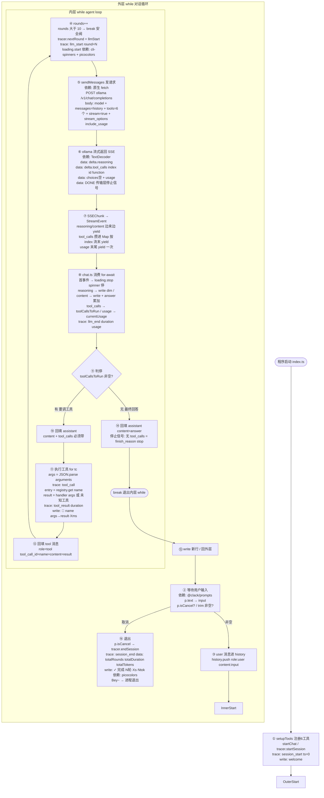

# Coderig Harness 完整运行流程（生图用）

> 本文档为"流程图生成"设计：每个编号节点 = 流程图一个框，框内标注真实数据格式。
> 配一个完整模拟任务：用户发"帮我把 src/cli/test.ts 里的 const 改成 let"，展示从输入到退出的每一步。
> 读完即可理解这个基础 harness 如何运作。

---

## 〇、依赖清单（每个库负责什么、何时介入）

| 依赖 | 角色 | 何时介入 |
|---|---|---|
| `@clack/prompts` | **用户输入**控件 | 外层 while 每轮调 `p.text()` 弹输入框；`p.isCancel()` 判取消 |
| `cli-spinners` | loading **帧数据** | `renderLoading()` 内取 `cliSpinners.dots.frames`（帧数组）和 `.interval`（tick 间隔） |
| `picocolors` | 终端**着色** | reasoning 用 `pc.dim`、错误用 `pc.red`、loading 帧用 `pc.cyan` |
| `node:fs/promises` | 工具**文件操作** | read/write/edit/grep/list_dir 全用它（可移植，非 Bun 专属） |
| `fast-glob` | glob 工具**按名搜索** | `glob` handler 内 `fg(pattern,{cwd,onlyFiles,ignore})` |
| 原生 `fetch` | **HTTP 请求** ollama | `sendMessages` 内裸 fetch（不用 SDK，手写流式） |
| 原生 `TextDecoder` | 字节流**解码** | `parseSSE` 内 Uint8Array → string |
| 原生 `setInterval` | loading **定时器** | `renderLoading().start()` 内每 tick 重画一帧 |

**loading 的起止**：
- **开始**：每轮 agent loop 开头 `loading.start()`（在内层 while 里、sendMessages 之前）。
- **结束**：`for await` 收到**第一个 StreamEvent** 时 `loading.stop()`（loading 的职责是覆盖"模型还没出第一个字"的等待空白）；出错时 catch/finally 兜底 stop。

---

## 一、核心数据结构（生图前先认清这三种"在节点间流动的数据"）

### 1. ChatMessage（history 数组的元素，发给 ollama 的 messages）
```json
// user 消息
{ "role": "user", "content": "帮我把 src/cli/test.ts 里的 const 改成 let" }

// assistant 调工具时(必须带 tool_calls)
{ "role": "assistant", "content": "",
  "tool_calls": [{ "id": "call_1", "type": "function",
    "function": { "name": "read_file", "arguments": "{\"path\":\"src/cli/test.ts\"}" } }] }

// assistant 最终回答(无 tool_calls)
{ "role": "assistant", "content": "已把 const 改成 let，修改完成。" }

// 工具结果(必须带 tool_call_id 对上哪次调用)
{ "role": "tool", "tool_call_id": "call_1", "name": "read_file",
  "content": "const num = 0;\nnum = 1;\nconsole.log(num);" }
```

### 2. StreamEvent（sendMessages 产出、chat.ts 消费的流式事件，4 种）
```json
{ "type": "reasoning", "text": "用户要改const为let，先读文件" }   // 边来边吐
{ "type": "content",   "text": "已修改" }                          // 边来边吐
{ "type": "tool_calls", "tool_calls": [完整ToolCall[]] }           // 流末攒齐再吐一次
{ "type": "usage", "usage": { "prompt_tokens": 120, "completion_tokens": 30, "total_tokens": 150 } } // 末尾一次
```

### 3. TraceEvent（Tracer 落盘到 logs/trace.jsonl 的事件）
```json
{ "seq": 1, "round": 0, "type": "session_start", "ts": 0 }
{ "seq": 2, "round": 1, "type": "llm_start",    "ts": 14176 }
{ "seq": 3, "round": 1, "type": "llm_end",      "ts": 30695, "duration": 16519,
  "data": { "contentLen": 0, "reasoningLen": 45, "toolCallsCount": 1,
    "usage": { "prompt_tokens": 120, "completion_tokens": 30, "total_tokens": 150 } } }
{ "seq": 4, "round": 1, "type": "tool_call",    "ts": 30700, "data": { "name": "read_file", "args": "{\"path\":\"src/cli/test.ts\"}" } }
{ "seq": 5, "round": 1, "type": "tool_result",  "ts": 30702, "duration": 2,
  "data": { "name": "read_file", "result": "const num = 0;…", "ok": true } }
```

---

## 二、完整模拟流程（任务：修改 test.ts 的 const→let）

> 用户终端实际看到的，左边；内部数据流，右边。每步标了【依赖】【日志节点】。

### 节点 1：程序启动
- **动作**：`index.ts` → `setupTools()` 注册 6 工具 → `startChat()`
- **依赖**：无（纯函数调用）
- **日志节点**：`tracer.startSession()` → 产生 `{seq:1, type:"session_start", ts:0}`
- **终端输出**：`welcome to the chat!`

### 节点 2：等待用户输入（外层 while）
- **动作**：`p.text({message:"请输入信息"})` 阻塞等输入
- **依赖**：`@clack/prompts`
- **终端**：显示输入框 `◇ 请输入信息 │ _`
- **用户键入**：`帮我把 src/cli/test.ts 里的 const 改成 let`
- **返回值**：`input: string`（取消则返回 symbol）
- **判断**：`p.isCancel(input)` → 否；`input.trim()` → 非空

### 节点 3：user 消息进 history
- **动作**：`history.push({role:"user", content:input})`
- **此时 history**：
```json
[ { "role": "user", "content": "帮我把 src/cli/test.ts 里的 const 改成 let" } ]
```

### 节点 4：进入内层 while（agent loop）— Round 1
- **动作**：`rounds=1`；`rounds>10?` 否；`tracer.nextRound()`(round=1) + `tracer.llmStart()`
- **日志节点**：`{seq:2, round:1, type:"llm_start", ts:14176}`
- **loading**：`loading.start()` → spinner 开始转（`cli-spinners` dots 帧 + `picocolors` 青色）

### 节点 5：sendMessages 发请求（裸 fetch）
- **动作**：`fetch("http://localhost:11434/v1/chat/completions")`
- **依赖**：原生 `fetch`
- **请求 body**：
```json
{ "model": "qwen3.5:4b",
  "messages": <当前 history>,
  "tools": <6 个 ToolDef 数组>,
  "stream": true,
  "stream_options": { "include_usage": true } }
```
- **若失败**：`!response.ok` → throw（被节点 8 catch）

### 节点 6：ollama 流式返回（SSE 字节流）
- **依赖**：原生 `fetch` response.body + `TextDecoder`
- **parseSSE 内部**：`reader.read()` → decode → buffer 拼接 → `split("\n")` → 识别 `data: ` 前缀 → `JSON.parse` → yield `SSEChunk`
- **真实 SSE 输出**（每个 `data:` 是一行）：
```
data: {"choices":[{"delta":{"role":"assistant","reasoning":"用户要改const为let,先读文件"}}],"..."}
data: {"choices":[{"delta":{"reasoning":"我需要先读取文件"}}],"..."}
data: {"choices":[{"delta":{"tool_calls":[{"index":0,"id":"call_1","type":"function","function":{"name":"read_file","arguments":"{\"path\":\"src/cli/test.ts\"}"}}]}}],"..."}
data: {"choices":[],"usage":{"prompt_tokens":120,"completion_tokens":30,"total_tokens":150}}
data: [DONE]
```
- **停止信号**：`data: [DONE]` = HTTP 流传输结束（传输层 EOF，不是"回答完成"的语义）

### 节点 7：sendMessages 把 SSEChunk 转成 StreamEvent（两种产出形态）
- **边来边吐**（每 chunk 立即 yield）：
  - `delta.reasoning` → `yield {type:"reasoning", text:"用户要改const为let,先读文件"}`
  - `delta.content` → 本轮无
- **累积不吐**（tool_calls 攒进 Map）：
  - `delta.tool_calls[0]` → `acc.get(0)` 建 slot，存 id/name/arguments
- **末尾一次**：
  - `chunk.usage` → `yield {type:"usage", usage:{...}}`（choices 为空的特殊 chunk）
- **流循环结束后攒齐再吐**：
  - `acc` → 完整 `ToolCall[]` → `yield {type:"tool_calls", tool_calls:[{id:"call_1",type:"function",function:{name:"read_file",arguments:"{...}"}}]}`

### 节点 8：chat.ts 消费 StreamEvent（for await）
- **首事件触发**：`if (!started) { loading.stop(); started=true }` → spinner 停（`cli-spinners` 帧停止 + `\r`清行）
- **渲染 + 累积**：
  - `reasoning` → `write(pc.dim(text))`（灰色思考流式打印）；`reasoningLen += text.length`
  - `content` → 本轮无
  - `tool_calls` → `toolCallsToRun = event.tool_calls`（存下，不执行）
  - `usage` → `currentUsage = event.usage`
- **终端此时**：
```
● round 1 · 思考中…
[推理]: 用户要改const为let,先读文件我需要先读取文件
```
- **流结束后**：`tracer.llmEnd({contentLen:0, reasoningLen:45, toolCallsCount:1, usage:currentUsage})`
- **日志节点**：`{seq:3, round:1, type:"llm_end", ts:30695, duration:16519, data:{...usage...}}`

### 节点 9：判停（本轮有没有 tool_calls）
- **判据**：`toolCallsToRun` 非空？
- **结论**：**有** → 不 break，执行工具，继续内层 while（这是"还要再问一次模型"的信号）
- **若为空**：模型已给最终回答 → push assistant → break 回外层（见节点 16）

### 节点 10：回填 assistant 消息（带 tool_calls）
- **动作**：`history.push({role:"assistant", content:"", tool_calls:toolCallsToRun})`
- **为什么必须带 tool_calls**：下一轮模型要靠 `tool_call.id` 对上结果

### 节点 11：执行工具（for tc of toolCallsToRun）
- **解析参数**：`args = JSON.parse(tc.function.arguments)` → `{path:"src/cli/test.ts"}`
- **日志节点（开始）**：`tracer.toolCall("read_file", args)` → `{seq:4, type:"tool_call", data:{name:"read_file", args:"{path...}"}}`
- **查 handler**：`entry = registry.get("read_file")` → 拿到 `{def, handler}`
- **执行**：`result = await entry.handler({path:"src/cli/test.ts"})`
  - handler 内部：`access(path)` 判存在 → `readFile(path,"utf8")` → 返回文件内容
- **result**：`"const num = 0;\nnum = 1;\nconsole.log(num);"`
- **日志节点（结束）**：`tracer.toolResult("read_file", result, true)` → `{seq:5, type:"tool_result", duration:2, data:{name,result:"const num=0;…",ok:true}}`
- **终端**：`🔧 read_file({"path":"src/cli/test.ts"}) → const num = 0;… · 2ms`

### 节点 12：回填 tool 结果消息
- **动作**：`history.push({role:"tool", tool_call_id:"call_1", name:"read_file", content:result})`
- **此时 history**（Round 1 结束，3 条）：
```json
[ {role:"user", content:"帮我把 const 改成 let"},
  {role:"assistant", content:"", tool_calls:[{id:"call_1", function:{name:"read_file", arguments:"{path:src/cli/test.ts}"}}]},
  {role:"tool", tool_call_id:"call_1", name:"read_file", content:"const num = 0;\nnum = 1;\nconsole.log(num);"} ]
```
- **继续内层 while** → Round 2

### 节点 13：Round 2 — 模型看到文件内容，决定 edit
- 重复节点 4~8：`nextRound`(round=2) + `llmStart` → `loading.start` → sendMessages（这次 history 带 tool 结果）
- **ollama 这轮返回**：reasoning("文件是 const num=0,要改成 let") + tool_calls(edit_file) + usage
- **edit_file 的 tool_call**：
```json
{ "id": "call_2", "type": "function",
  "function": { "name": "edit_file",
    "arguments": "{\"path\":\"src/cli/test.ts\",\"oldString\":\"const num = 0;\",\"newString\":\"let num = 0;\"}" } }
```
- **执行**：`editFileHandler` → `readFile` → 找 `oldString` 唯一匹配 → 替换 → `writeFile`
- **result**：`"已修改 src/cli/test.ts"`
- **日志**：`tool_call`(call_2) + `tool_result`(duration, ok:true)
- **history 回填**：push assistant(带 tool_calls) + push tool 消息
- **判停**：有 tool_calls → 继续 Round 3

### 节点 14：Round 3 — 模型看到 edit 成功，给最终回答（**停止信号在这里**）
- sendMessages 这轮 ollama 返回：reasoning("修改已完成") + content("已把 const 改成 let，修改完成。") + usage
- **关键：本轮没有 tool_calls** → `toolCallsToRun` 为空
- **for-await 渲染**：reasoning 灰色流式 → content 正常色流式打印
- **终端此时**：
```
● round 3 · 思考中…
[推理]: 修改已完成
已把 const 改成 let，修改完成。
```

### 节点 15：判停 → break（停止信号）
- **判据**：`toolCallsToRun` 为空（等价于 `finish_reason:"stop"`，但不解析它）
- **动作**：`history.push({role:"assistant", content:"已把 const 改成 let，修改完成。"})` → `break`（退出内层 while）
- **这是"可以开始回复了"的判定**：模型本轮不产 tool_calls = 它认为信息够了，给了最终回答
- **回到外层 while**：`write("\n")` 换行 → 跳回节点 2 等下一次输入

### 节点 16：用户取消 → 退出
- **动作**：用户 ctrl+c → `p.isCancel(input)` 为真
- **日志节点**：`tracer.endSession()` → 内部算汇总 → 产生 `{seq:N, type:"session_end", ts:总时, data:{totalRounds:3, totalDuration:125000, totalTokens:450}}`
- **终端汇总**：`✓ 完成 · 3 轮 · 125.0s · 450 tokens`（依赖 `picocolors`）
- **终端**：`Bey~` → 进程退出

---

## 三、流程图（线性节点，每框=一个动作，框内是真实数据）

```
┌─────────────────────────────────────────────────────────────────────────┐
│ ① 程序启动                                                              │
│   setupTools()→注册6工具 / startChat()                                  │
│   日志: trace{session_start, ts:0}                                      │
└──────────────────────────────────┬──────────────────────────────────────┘
                                   ▼
┌─────────────────────────────────────────────────────────────────────────┐
│ ② 等待用户输入  [依赖: @clack/prompts]                                  │
│   p.text() → input: "帮我把 src/cli/test.ts 里的 const 改成 let"        │
│   p.isCancel? 否  /  trim 非空                                          │
└──────────────────────────────────┬──────────────────────────────────────┘
                                   ▼
┌─────────────────────────────────────────────────────────────────────────┐
│ ③ user 消息进 history                                                   │
│   history = [{role:"user", content:"帮我把...const改成let"}]            │
└──────────────────────────────────┬──────────────────────────────────────┘
                                   ▼
   ┌──────────────── 内层 while (agent loop) ────────────────┐
   │                                                            │
   │  ④ rounds++  (rounds>10→break 安全阀)                     │
   │     tracer.nextRound() + llmStart()                       │
   │     日志: trace{llm_start, round:N}                        │
   │     loading.start()  [依赖: cli-spinners + picocolors]    │
   │                          │                                │
   │                          ▼                                │
   │  ⑤ sendMessages 发请求  [依赖: 原生 fetch]                │
   │     POST ollama /v1/chat/completions                      │
   │     body={model, messages:history, tools:6个,             │
   │           stream:true, stream_options:{include_usage:true}}│
   │                          │                                │
   │                          ▼                                │
   │  ⑥ ollama 流式返回 SSE  [依赖: TextDecoder]               │
   │     data: {delta:{reasoning:"..."}}                       │
   │     data: {delta:{tool_calls:[{index,id,function:{...}}]}}│
   │     data: {choices:[], usage:{prompt,completion,total}}   │
   │     data: [DONE]  ← 传输层停止信号                         │
   │                          │                                │
   │                          ▼                                │
   │  ⑦ sendMessages 转 StreamEvent                           │
   │     reasoning/content → 边来边 yield                       │
   │     tool_calls → 攒进Map(按index),流末统一 yield           │
   │     usage → 末尾 yield 一次                                │
   │                          │                                │
   │                          ▼                                │
   │  ⑧ chat.ts 消费 (for await)                               │
   │     首事件 → loading.stop()  [spinner停]                  │
   │     reasoning → write(pc.dim) 灰色流式                    │
   │     content  → write + answer+=                           │
   │     tool_calls → toolCallsToRun = event                    │
   │     usage → currentUsage = event                          │
   │     日志: trace{llm_end, duration, data:{len,usage}}       │
   │                          │                                │
   │                          ▼                                │
   │  ⑨ 判停: toolCallsToRun 非空?                              │
   │           ┌────────┴────────┐                            │
   │           ▼                 ▼                            │
   │     【空→停止】        【非空→执行工具】                    │
   │           │                 │                            │
   │           │                 ▼                            │
   │           │     ⑩ push assistant(content+tool_calls)     │
   │           │     ⑪ for tc:                                 │
   │           │          args=JSON.parse(arguments)          │
   │           │          trace{tool_call}                     │
   │           │          entry=registry.get(name)             │
   │           │          result=handler(args)                │
   │           │          trace{tool_result,duration}          │
   │           │          write "🔧 name(args)→result·Xms"    │
   │           │     ⑫ push {role:tool,tool_call_id,content}  │
   │           │                 │                            │
   │           │                 └──→ 回到 ④ (下一轮)           │
   │           ▼                                              │
   │     ⑭ push assistant(content)                            │
   │     break (退出内层)                                      │
   └─────────────────────────┬────────────────────────────────┘
                             ▼
┌─────────────────────────────────────────────────────────────────────────┐
│ ⑮ 回到外层: write("\n") → 回到 ② 等下一次输入                          │
└──────────────────────────────────┬──────────────────────────────────────┘
                                   ▼ (用户取消)
┌─────────────────────────────────────────────────────────────────────────┐
│ ⑯ 退出  p.isCancel → tracer.endSession()                                │
│   日志: trace{session_end, data:{totalRounds:3,totalDuration,totalTokens}}│
│   终端: "✓ 完成 · 3 轮 · 125.0s · 450 tokens"  [picocolors]             │
│   "Bey~" → 进程退出                                                      │
└─────────────────────────────────────────────────────────────────────────┘
```

---

## 四、history 数组在 3 轮中的演变（真实数据）

### Round 1 开始前
```json
[ { "role": "user", "content": "帮我把 src/cli/test.ts 里的 const 改成 let" } ]
```

### Round 1 结束后（读到了文件）
```json
[
  { "role": "user", "content": "帮我把 src/cli/test.ts 里的 const 改成 let" },
  { "role": "assistant", "content": "",
    "tool_calls": [{ "id": "call_1", "type": "function",
      "function": { "name": "read_file", "arguments": "{\"path\":\"src/cli/test.ts\"}" } }] },
  { "role": "tool", "tool_call_id": "call_1", "name": "read_file",
    "content": "const num = 0;\nnum = 1;\nconsole.log(num);" }
]
```

### Round 2 结束后（改完了文件）
```json
[
  { "role": "user", "content": "帮我把 src/cli/test.ts 里的 const 改成 let" },
  { "role": "assistant", "content": "", "tool_calls": [read_file call_1] },
  { "role": "tool", "tool_call_id": "call_1", "name": "read_file", "content": "const num = 0;…" },
  { "role": "assistant", "content": "",
    "tool_calls": [{ "id": "call_2", "type": "function",
      "function": { "name": "edit_file",
        "arguments": "{\"path\":\"src/cli/test.ts\",\"oldString\":\"const num = 0;\",\"newString\":\"let num = 0;\"}" } }] },
  { "role": "tool", "tool_call_id": "call_2", "name": "edit_file", "content": "已修改 src/cli/test.ts" }
]
```

### Round 3 结束后（给了最终回答，停止）
```json
[
  ...上面5条...,
  { "role": "assistant", "content": "已把 const 改成 let，修改完成。" }
]
```

---

## 五、停止信号与判停规则（重点框）

| 节点 | 信号 | 含义 | harness 反应 |
|---|---|---|---|
| ⑥ `data: [DONE]` | 传输层 EOF | 这条 HTTP 流字节传完了 | parseSSE return，for await 结束 |
| ⑦ usage chunk | `choices:[]`+`usage` | 流的最后一个特殊 chunk | sendMessages yield 一次 usage |
| ⑨ 有 tool_calls | 模型要调工具 | 信息不够，继续 | 执行工具 + 回填 + **继续内层** |
| ⑨ 无 tool_calls | 模型给了最终回答 | 信息够了，可回复 | push assistant + **break**（=停止信号） |
| rounds>10 | 安全阀 | 防死循环 | renderError + break |

**"可以开始回复了"的判定** = 本轮 `toolCallsToRun` 为空（等价 `finish_reason:"stop"`，但不解析 finish_reason）。

**"传输停止"** ≠ **"回答停止"**：每轮 sendMessages 都是一次独立 HTTP 流，每轮都有自己的 `[DONE]`。多轮 agent loop = 多条流。回答停止靠"无 tool_calls"判定，不靠 `[DONE]`。

---

## 六、日志节点总览（trace.jsonl 一条对话的完整事件序列）

```
seq 1  session_start   round 0  ts 0          ── 程序启动
seq 2  llm_start       round 1  ts 14176      ── Round1 LLM开始
seq 3  llm_end         round 1  ts 30695  dur 16519  ── Round1 LLM结束(usage)
seq 4  tool_call       round 1  ts 30700      ── read_file 调用
seq 5  tool_result     round 1  ts 30702  dur 2      ── read_file 返回
seq 6  llm_start       round 2  ts 31000      ── Round2 LLM开始
seq 7  llm_end         round 2  ts 41000  dur 10000 ── Round2 LLM结束
seq 8  tool_call       round 2  ts 41001      ── edit_file 调用
seq 9  tool_result     round 2  ts 41005  dur 4      ── edit_file 返回
seq 10 llm_start       round 3  ts 42000      ── Round3 LLM开始(最终回答)
seq 11 llm_end         round 3  ts 52000  dur 10000 ── Round3 LLM结束(无tool_calls→停止)
seq 12 session_end     round 0  ts 125000 data:{totalRounds:3,totalDuration:125000,totalTokens:450}
```

**点事件**（session_start/end, llm_start, tool_call, error）只记时刻；
**段事件**（llm_end, tool_result）用"记住的开始 ts"算 duration。
每条**立即 appendFile 落盘**，崩了也有部分 trace。

---

## 七、一图速记（看到这张图就懂 harness 怎么运作）

```
用户输入(clack) → 进history → ┌─ 内层while ─────────────────────────┐
                              │ 轮数检查(>10停)                       │
                              │ tracer.llmStart + loading.start       │
                              │   ↓                                   │
                              │ sendMessages: fetch ollama(裸fetch)    │
                              │   ↓                                   │
                              │ parseSSE: 字节→SSEChunk(TextDecoder)  │
                              │   ↓                                   │
                              │ SSEChunk→StreamEvent(边来边吐/攒齐再吐) │
                              │   ↓                                   │
                              │ chat.ts消费: 首事件loading.stop,      │
                              │   渲染reasoning/content, 收tool_calls  │
                              │   收usage                              │
                              │ tracer.llmEnd                         │
                              │   ↓                                   │
                              │ 判停: 有tool_calls?                   │
                              │   ├─有→执行工具(registry.get+handler) │
                              │   │     tracer.toolCall/Result        │
                              │   │     回填assistant+tool消息         │
                              │   │     →回内层while顶                 │
                              │   └─无→回填assistant(最终回答)→break   │
                              └──────────────────────────────────────┘
                              ↓
                         回外层等输入 → 用户取消 → tracer.endSession → 退出
```

---

## 八、Mermaid 流程图（可直接渲染/喂生图）



### Mermaid 节点说明（喂生图时配合阅读）

- **矩形 `[]`** = 普通动作节点（①~⑫、⑭、⑮）。
- **菱形 `{}`** = 判停分支（⑨），两条出路：有 tool_calls → 执行工具回循环顶；无 → 停止。
- **圆角 `([""])`** = 起点/终点（程序启动、break、退出）。
- **虚线框 subgraph** = 两层 while：`Outer` 外层对话循环、`Inner` 内层 agent loop。Inner 内部有**自循环**（PushTool → Round），即"调完工具再问一次模型"。
- 每个节点标了 **依赖** 和 **trace 事件**，框内数据格式见上文第二~六节。

